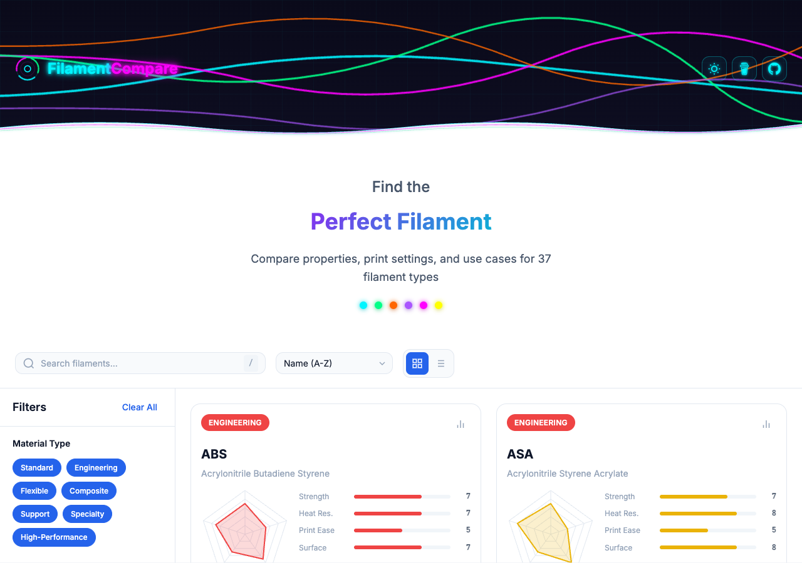
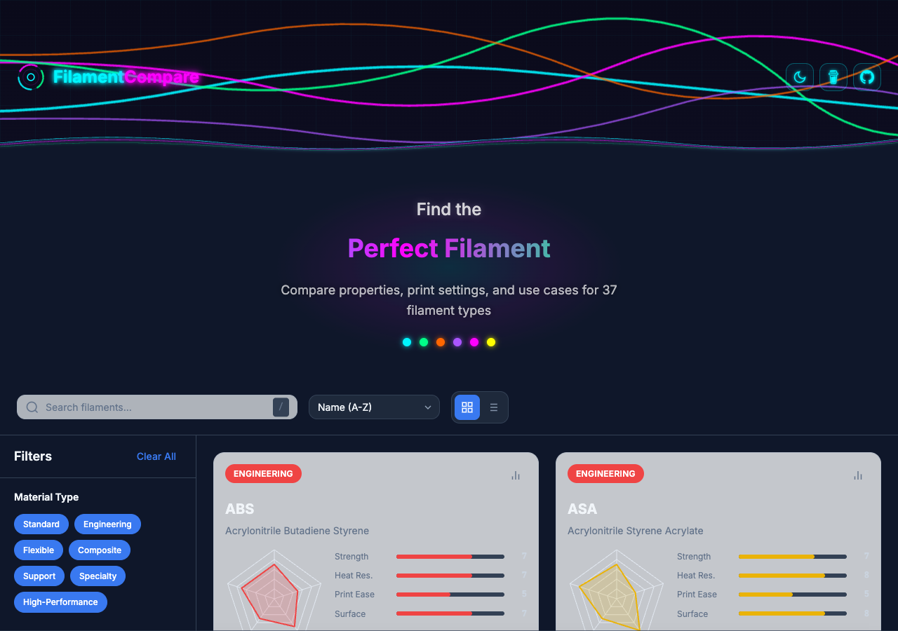

# 3D Filament Comparison Tool

An interactive, mobile-responsive web application for comparing 3D printing filament properties, print settings, and use cases.

**[Live Demo](https://codeshrew.github.io/3D-Filament-Comparison-Tool/)** | [GitHub Repository](https://github.com/codeshrew/3D-Filament-Comparison-Tool)

### Light Mode

### Dark Mode

## Features

- **37 Filament Types**: Comprehensive database including standard (PLA, PETG, PHA), engineering (ABS, ASA, Nylon, PC, POM, CPE), flexible (TPU, TPE), composite (Carbon Fiber, Glass Fiber, Wood, Metal-filled), support materials (PVA, BVOH, HIPS, Breakaway), specialty (Silk, Glow-in-Dark, Conductive, ESD-Safe), and high-performance (PEEK, PEI, PEKK, PPS-CF, PPSU)
- **Mechanical Properties**: Real-world data including tensile strength (MPa), flexural modulus (GPa), and heat deflection temperature (°C)
- **Filament Compatibility Matrix**: Multi-material printing compatibility ratings for combining different filaments
- **Interactive Radar Charts**: Visual property comparisons using Chart.js
- **Side-by-Side Comparison**: Compare up to 4 filaments simultaneously with overlay charts
- **Advanced Filtering**: Filter by 7 material categories, 4 difficulty levels, temperature range, and special requirements
- **Smart Search**: Search by name, material type, or use case
- **Responsive Design**: Works seamlessly on desktop, tablet, and mobile
- **Dark/Light Theme**: Automatic detection with manual toggle
- **Persistent State**: Remembers your theme preference and comparison selections

## Properties Compared

Each filament is rated on a 1-10 scale for:
- Strength
- Flexibility
- Heat Resistance
- UV Resistance
- Chemical Resistance
- Ease of Printing
- Layer Adhesion
- Surface Quality

## Mechanical Properties

Real-world engineering data for each filament:
- Tensile Strength (MPa) - Maximum stress before breaking
- Flexural Modulus (GPa) - Stiffness/rigidity measure
- Heat Deflection Temperature (°C) - Temperature at which material deforms under load

## Print Settings

Detailed print settings for each filament including:
- Nozzle temperature range
- Bed temperature range
- Special requirements (enclosure, hardened nozzle, drying)
- Difficulty level
- Cost range

## Filament Compatibility

Multi-material printing compatibility matrix showing how well different filaments bond together:
- **Excellent**: Strong chemical bond, ideal for multi-material prints
- **Good**: Reliable adhesion for most applications
- **Fair**: Moderate adhesion, may work with proper settings
- **Poor**: Weak adhesion, not recommended
- **None**: Incompatible materials

## Technology Stack

- **HTML5** - Semantic markup with accessibility features
- **CSS3** - Custom properties, CSS Grid, Flexbox, animations
- **Vanilla JavaScript** - ES6+ with modular architecture
- **Chart.js** - Interactive radar charts via CDN
- **Google Fonts** - Inter & JetBrains Mono

## Deployment

This site is deployed using GitHub Pages. To deploy your own:

1. Fork this repository
2. Go to Settings > Pages
3. Set Source to "Deploy from a branch"
4. Select the `main` branch and `/ (root)` folder
5. Save and wait for deployment

The site will be available at `https://[username].github.io/3D-Filament-Comparison-Tool/`

## Local Development

No build step required! Simply:

1. Clone the repository
2. Open `index.html` in a browser
3. Or use a local server: `python -m http.server 8000`

## License

MIT License - feel free to use, modify, and distribute.

## Credits

Data compiled from various 3D printing resources including Simplify3D, Prusa Knowledge Base, MatterHackers, and community expertise.
